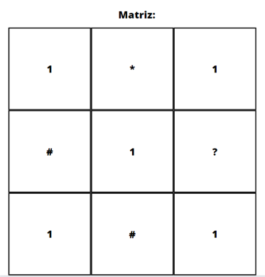
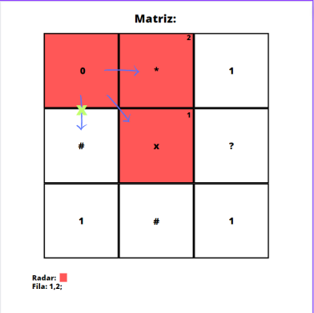
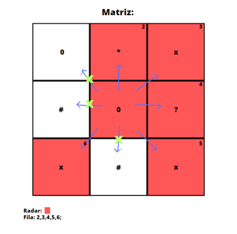

# Labirinto por Profundidade (DFS), Largura (BFS) e Randômico

    
 
 
</a> 

 

 

Componentes: José Marconi de Almeida Júnior, Lucas Fernandes Barbosa de Andrade.

A atividade se trata de se ler uma matriz, quadrática, de um arquivo, que será o labirinto. Ele deve ser percorrido de 3 formas diferentes: Randomicamente, por Profundidade(DFS) e por Largura(BFS). A matriz sera composta pelos seguintes caracteres:

|          Caractere            | Função                                                                                                                                                    |
| ------------------------------| --------------------------------------------------------------------------------------------------------------------------------------------------------- |
|  `#`                          | Parede, o <i>player</i> não pode andar para as posições com esse caractere.                                                                               |
|  `*`                          | Perigo, quando adentrar a uma casa com esse caractere, o caminhamento é resetado para a posição inicial nas 3 formas sendo iniciado novamente totalmente do zero e o caractere é trocado para `1`.                                                                                                                                                                                        |
|  `1`                          | São as casas que podem ser percorridas normalmente.                                                                                                       |
|  `?`                          | Ponto de parada, quando o <i>player</i> cair nessa casa, ele sai do labirinto e o programa passa para a próxima forma de caminhamento ou até encontrar nos 3 casos e finalizar os labirintos.                                                                                                                                                            |

A matriz utilizada será a mesma para as 3 formas diferentes de percorrer e seus caracteres devem ser alocados de maneira totalmente aleatória. Além do mais, é necessário uma comparação entre os 3 algoritimos de caminhamento, mostrando o número de passos dados e tempo de execução para finalização da matriz.  

 

 

# Arquivos e Funções

O código é dividido em 7 arquivos, sendo eles:

|  Arquivo                        |   Função                                                                                          |
| ------------------------------- | ------------------------------------------------------------------------------------------------- |
|  `main.c`                       | Arquivo principal para iniciar o algoritimo.                                                      |
|  `lab.h`                        | Define as funções para tratamento da matrizes e arquivo, e as funções de caminhamento.            |
|  `lab.c`                        | Formatação das funções declaradas no arquivo lab.h.                                               |
|  `queue.h`                      | Define as funções para se trabalhar com a fila.                                                   |
|  `queue.c`                      | Formatação das funções declaradas na queue.h.                                                     |
|  `stack.h`                      | Define as funções para se trabalhar com a pilha.                                                  |
|  `stack.c`                      | Formatação das funções declaradas na stack.h                                                      |

As funções mais importantes utilizadas são:

|  Função                                                       |  Funcionalidade                                                                                   |
| ------------------------------------------------------------- | ------------------------------------------------------------------------------------------------- |
|  `LerMatriz` - [`lab.c`, linhas 6 a 74]                       | Realiza a leitura do arquivo, salvando a matriz utilizada e chamando as funções de caminhamento;  |
|  `Caminho` - [`lab.c`, linhas 76 a 223]                       | Realiza o caminhamento Randomico;                                                                 |
|  `DFS` - [`lab.c`, linhas 225 a 312]                          | Realiza o caminhamento em Profundidade;                                                           |
|  `BFS` - [`lab.c`, linhas 335 a 994]                          | Realiza o caminhamento em Largura;                                                                |

As funções utilizadas dos arquivos <i>queue.h<i>/<i>stack.h<i> e <i>queue.c<i>/<i>stack.c<i> são apenas para auxiliar na lógica de movimentação implementada. 

 

 

# Fila (queue) e Pilha (stack)

As fila e pilha utilizadas no trabalho foram utilizadas para auxiliar na forma de caminhamento da matriz, a utilização delas é mais especificadas na lógica implementada.

Mas segue um quadro para explicar rapidamente como funcionam as funções implementadas relacionadas a fila e a pilha:

|  Função                         |   Funcionalidade                                                                                  |
| ------------------------------- | ------------------------------------------------------------------------------------------------- |
|  `FFvzia` e `FPvzia`            | Utilizadas para inciar as fila e pilha e alocar os ponteiros no topo e na base.                   |
|  `isVaziaQueue` e `isVaziaStack`| Retorna um booleano como true, caso a fila ou pilha esteja vazia.                                 |
|  `Enfileira` e `Push`           | Salva os valores na fila e na pilha.                                                              |
|  `Desenfileira` e `Pop`         | No caso da fila, retira o primeiro elemento e da pilha retira o último elemento                   |
|  `Fimprime` e `Pimprime`        | Retorna na tela toda a fila ou pilha.                                                             |

 

 

# Lógica Implementada

|  Posições possíveis de caminhar                                                                   |
| ------------------------------------------------------------------------------------------------- |
| Direita (Leste);                                                                                  |
| Esquerda (Oeste);                                                                                 |
| Cima (Norte);                                                                                     |
| Baixo (Sul)                                                                                       |
| Diagonal de Cima a Direita (Nordeste)                                                             |
| Diagonal de Cima a Esquerda (Noroeste)                                                            |
| Diagonal de Baixo a Direita (Sudeste)                                                             |
| Diagonal de Baixo a Esquerda (Sudoeste)                                                           |       

# Random

# DFS

# BFS

A lógica implementada no encaminhamento em largura (BFS), foi utilizando uma espécie de "radar". 

O <i>player<i> inicia sempre na posição <i>[0][0]<i> da matriz (que sempre será <i>1<i>), a partir dela, primeiro é verificado o raio do local onde ele está. Averiguando todas as posições possíveis para caminhar, levando sempre em consideração o raio da matriz, e mudando o caractere delas para <i>x<i>, mas somente se o caractere da posição for <i>1<i>, se for <i>*<i> ou <i>?<i> o caractere não trocado. Dessa forma, ele salva todas essas posições que ele pode caminhar, que são as posições diferentes de <i>#<i>, <i>x<i> e <i>0<i>. Elas são salvas em uma fila, que é utilizada para caminhar. 

Ele sempre caminhará para a primeira coordenada da fila, e o caractere da posição será trocado para <i>0<i>. No momento que isso acontece, essa coordenada já utilizada é retirada da fila, e então utilizará novamente o radar para salvar novas posições para a fila e em seguida caminhará para a posição seguinte que estiver salva.

Caso o <i>player<i> caia em uma posição com o caractere <i>*<i>, o caractere será trocado para <i>1<i>, e o <i>player<i> voltara para a posição inicial da matriz(<i>[0][0]<i>), e a matriz até então modificada, é resetada para como estava anteriormente, porém com a nova mudança de caractere. Dessa forma, sempre que o player cair no perigo, ele recomeça o caminho e aquele perigo é retirado. A fila também é sempre limpa nesse momento, começando a salvar as posições desde o inicio novamente.

A condição de vitória do <i>player<i> é caso ele consiga cair na casa com o caractere <i>?<i>. Logo após isso, é imprimida na tela a matriz modificada, o tempo de execução e o número de passos totais que ele deu para conseguir vencer. Os passos do personagem não são resetados quando ele cair nos perigos. Há ainda a condição de parada, caso ele não encontre a <i>?<i>, o algoritimo para assim que a fila estiver vazia, logo, até ele percorrer todas as posições possiveis na matriz.

Exemplo em imagens do comportamento do <i>player<i> e a utilização do "radar":

  

  

  

 

 
  
      
      
  

</a>

 

 

Exemplo de saída do BFS:

 

 

# Testes Realizados

Os testes foram feitos rodando o programa 10 vezes, guardando os valores dos passos e do tempo que foram necessários, e tirado a médias dos valores. Detalhe que, no programa o tempo de execução é retornado em segundos, porém, para os resultados finais, para uma melhor visualização, os valores foram transformados para milissegundos.

A primeira bateria de testes foi realizado na seguinte matriz:

É uma matriz que em que não é possível chegar ao <i>?<i>, logo, de certa forma, eles caminham por toda a matriz até um critério de parada. Nesta matriz, até os critérios de parada conseguimos os seguintes valores:

|  Modo de percorrer              | Média do tempo de execução(ms)| Média de passos totais dados          |
| ------------------------------- | ----------------------------- | ------------------------------------- |
|  `Randomico`                    |            236859             |            6541119                    |
|  `DFS`                          |             53093             |             488585                    |
|  `BFS`                          |             52098             |             656450                    |

 

 

A segunda bateria de testes foi realizado na seguinte matriz:

É uma matriz que em que é possível chegar ao <i>?<i>, e se encontra na última posição da matriz([49][49]):

|  Modo de percorrer              | Média do tempo de execução(ms)| Média de passos totais dados          |
| ------------------------------- | ----------------------------- | ------------------------------------- |
|  `Randomico`                    |             62733             |            1663778                    |
|  `DFS`                          |              2158             |                968                    |
|  `BFS`                          |             53528             |             659041                    |

 

 

A terceira bateria de testes foi realizado na seguinte matriz:

É uma matriz que em que é possível chegar ao <i>?<i>, e se encontra na posição <i>[0][49]<i>:

|  Modo de percorrer              | Média do tempo de execução(ms)| Média de passos totais dados          |
| ------------------------------- | ----------------------------- | ------------------------------------- |
|  `Randomico`                    |             17117             |             435265                    |
|  `DFS`                          |              6247             |              27679                    |
|  `BFS`                          |             46142             |             538837                    |

 

 

A quarta bateria de testes foi realizado na seguinte matriz:

É uma matriz que em que é possível chegar ao <i>?<i>, e se encontra na posição <i>[49][0]<i>:

|  Modo de percorrer              | Média do tempo de execução(ms)| Média de passos totais dados          |
| ------------------------------- | ----------------------------- | ------------------------------------- |
|  `Randomico`                    |             39381             |            1043907                    |
|  `DFS`                          |             25768             |             203230                    |
|  `BFS`                          |             53260             |             636736                    |

 

 

A quinta bateria de testes foi realizado na seguinte matriz:

É uma matriz que em que é possível chegar ao <i>?<i>, e se encontra na posição <i>[5][7]<i>:

|  Modo de percorrer              | Média do tempo de execução(ms)| Média de passos totais dados          |
| ------------------------------- | ----------------------------- | ------------------------------------- |
|  `Randomico`                    |              3848             |              70338                    |
|  `DFS`                          |             24051             |             178565                    |
|  `BFS`                          |              4764             |              24764                    |

 

 

# Análise dos Testes

Levando em consideração o primeiro exemplo mostrado de uma matriz sem ponto de chegada, apesar de menos passos dados, o DFS é ainda mais lento em tempo de execução que o BFS. Enquanto o Randomico é necessário um certo critério de parada que pode deixa-ló mais lento que os demais.

No segundo exemplo temos que o ponto de chegada se encontra na última posição da matriz. Nesse caso, o DFS foi infinitamento superior que ambos BFS e Randomico, tanto em tempo de execução quanto em quantidade de passos. Entre BFS e Randômico, o tempo de execução foi por uma diferença de 10000ms (dez mil milissegundos), uma diferença relativamente pequena, levando em consideração que o Randômico contém uma média de passos quase duas vezes maior que o BFS.

Na terceira matriz temos o ponto de chegada no topo da matriz e na sua última coluna. Mais um caso em que o DFS supera e muito os outros dois casos com um tempo de execução ainda bem menor que a metade do tempo de execução do segundo melhor que nesse caso foi o Randômico, mas, em relação aos passos dados, DFS teve um aumento consideável com relação ao teste anterior. Esse é um caso em que o BFS se desempenhou relativamente mal para encontrar o ponto de chegada mas teve uma performance melhor que o caso anterior tanto em tempo de execução quanto em passos. Enquanto o randômico se performou extremamente bem em comparação ao caso anterior.

A quarta matriz contém o ponto de chegada na última linha e na primeira coluna. E é mais um caso em que o DFS performou melhor que os demais, porém com um aumento significativo tanto de tempo de execução quanto em número de passos, batendo seus maiores valores até então, com excessão da primeira utilizada para mostrar o caso em que não há ponto de chegada. BFS nesse caso foi bem parecido com o caso de teste 2 em seus valores, e novamente foi o maior em tempo de execução mesmo com menos passos que o Randômico, que novamente excedeu os 1000000(1 milhão) de passos. 

O caso de teste 5 contém um ponto de chegada mais próximo da posição de inicio, porém está envolta de paredes, tendo sua única entrada sendo por baixo. Nesse caso, DFS foi de longe o pior tanto em tempo de execução quanto em passos, porém se comparar com os valores dos testes anteriores, mesmo sendo um caso espécifico e que ele perde em muito, os valores são relativamente baixos. Com relação ao BFS, novamente ele perdeu para o Randômico mesmo tendo quase 3(três) vezes menos passos que o randômico, perdendo por 1000ms(mil milissegundos). Esse foi um caso em que a média do Randômico acabou sendo melhor que o BFS, mesmo em algum dos testes ele realizando valores muito maiores, sua média continuou sendo a menor mesmo com uma média alta de passos conferidos.  

 

 

# Conclusão

A partir dos testes realizados, foi possível perceber certos padrões relacionados aos BFS e DFS. Quanto mais longe o ponto de chegada estiver e mais próximos das bordas, mais o BFS demora para encontrar, pois pela sua lógica, ele sempre visitara todas as posições possíveis até o ponto de chegada. Enquanto ao DFS, ele se provou ser melhor que os outros dois na grande maioria dos casos, ele só perderá em tempo de execução para casos especificos onde o ponto de chegada se encontra mais próximo do ponto de partida e com paredes alocadas de maneiras específicas, e mesmo em seu pior dos casos, seus valores foram relativamente baixo. 

Com relação ao randomico, seu desempenho não foi relativamente ruim, apesar da média de passos ser extremamente imprevisel e altos, há casos em que ele pode ser melhor que os outros dois em tempo de execução mesmo com sua ainda alta média de passos, e casos em que ele vai ser o pior de todos. Mas devido a sua imprevisibilidade ele acaba por se tornar uma escolha perigosa para utilização.  

Logo, conlcuimos que, para um "tiro no escuro", seria melhor apostar no DFS para busca. O BFS apenas para buscas em casos específicos em que o se tem noção que o objetivo esteja próximo do ponto de partida. O Randômico é uma faca de dois gumes, não é recomendado a utilização pois, se pode ter uma maré de casos ruins, assim como de casos bons, sua imprevisibilidade não trás confiança na sua busca.

 

 

# Especificações do Dispositivo utilizado

|                                                                                                                            |
| -------------------------------------------------------------------------------------------------------------------------- |
|  `Processador`         -> Intel(R) Core(TM) i7-8565U CPU @ 1.80GHz   1.99 GHz                                              |
|  `RAM Instalada`       -> 16.0 GB (utilizável: 15.8 GB)                                                                    |
|  `Tipo de Sistema`     -> Sistema operacional de 64 bits, processador baseado em x64                                       |
|  `Sistema Operacional` -> Edição Windows 10 Home Single Language, versão 21H2                                              |

 

 

# Compilação e Execução

Esse pequeno exemplo possui um arquivo Makefile que realiza todo o procedimento de compilação e execução. Para tanto, temos as seguintes diretrizes de execução:

| Comando                |  Função                                                                                           |
| -----------------------| ------------------------------------------------------------------------------------------------- |
|  `make clean`          | Apaga a última compilação realizada contida na pasta build                                        |
|  `make`                | Executa a compilação do programa utilizando o gcc, e o resultado vai para a pasta build           |
|  `make run`            | Executa o programa da pasta build após a realização da compilação                                 |

 

 

# Contatos

 

<a style="color:black" href="mailto:jmarconiadm@outlook.com?subject=[GitHub]%20Source%20Dynamic%20Lists">
✉️ <i>jmarconiadm@outlook.com</i>
</a>